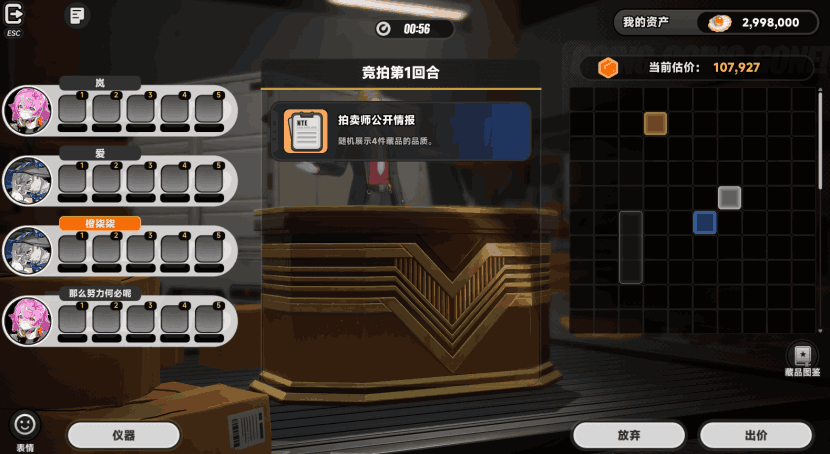
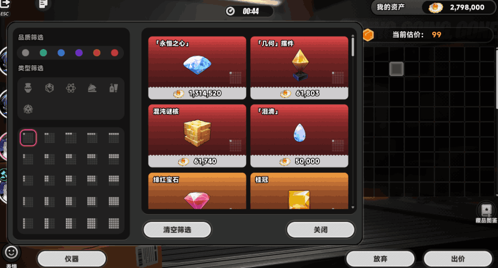
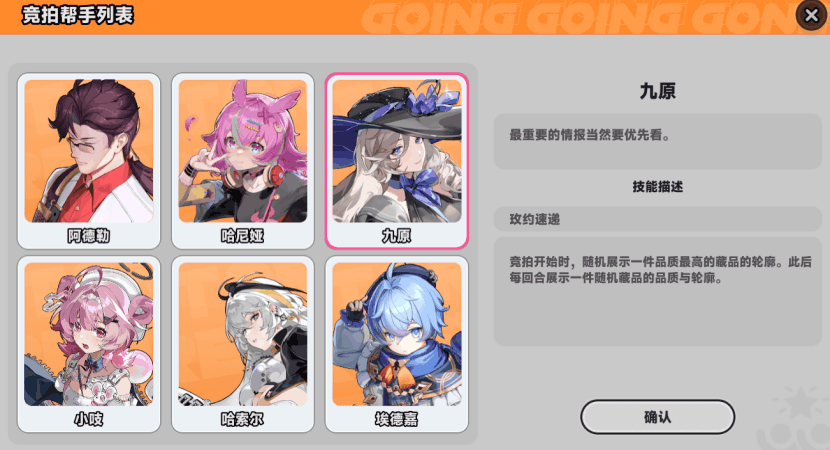
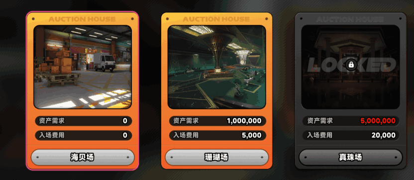
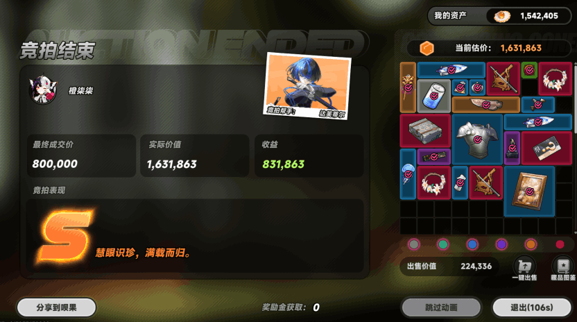
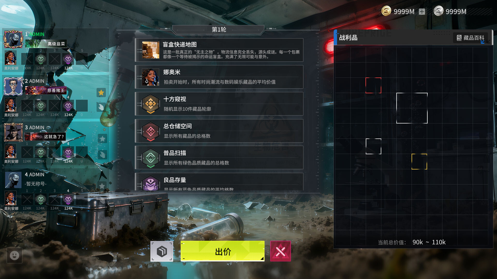
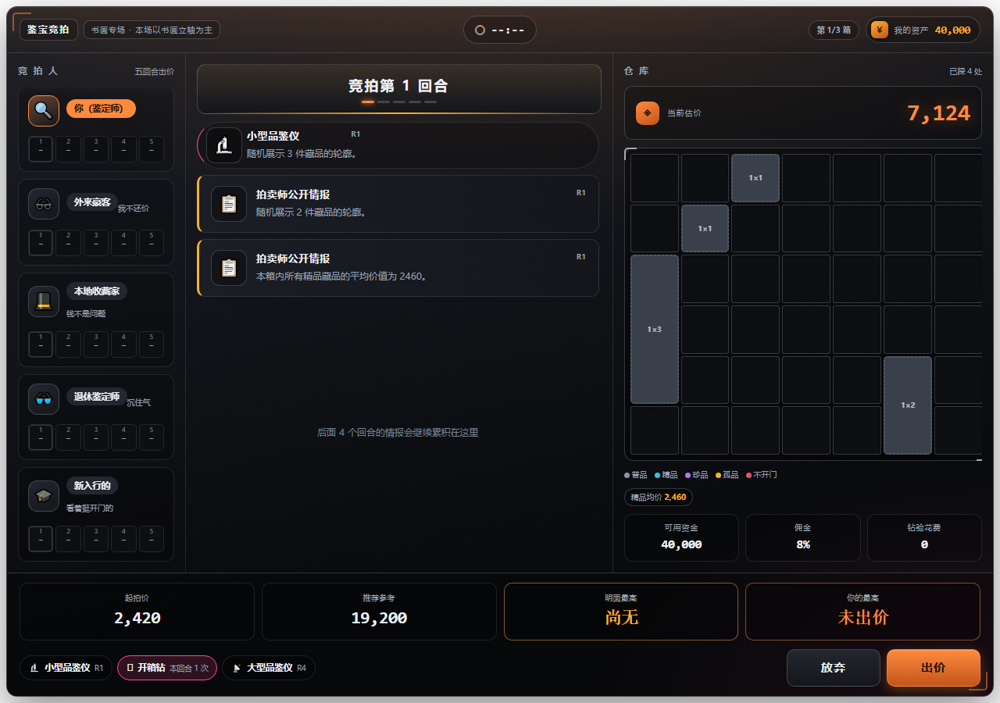
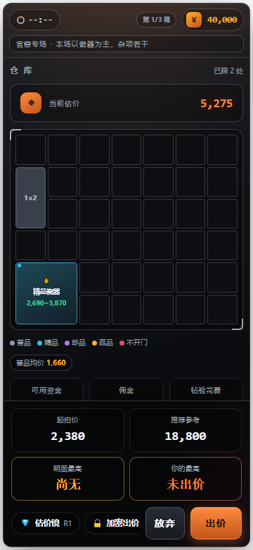

# 02 · 界面布局拆解

本节来自实际下载图片和本地页面截图的观察。**测量是对现有图片的大致占比，不是源游戏布局规范**。图名 NTE 852 表示 `images/nte/image-852.png`，BK 02 表示 `images/bidking/steam-02.jpg`。

## 1. 竞拍主屏：结构已经很接近



来源：S04 所嵌游戏截图；原图 830×454。图中剩余时间为 00:56，**这只证明拍摄时剩余 56 秒，不证明每回合固定 60 秒**。

| 区域 | 画面位置/大致占比 | 主要信息 | 为什么重要 |
|---|---|---|---|
| 退出、日志 | 左上角 | 返回和信息入口 | 不干扰竞价主动作 |
| 参与者列表 | 左侧约 29% 宽 | 4 位角色、身份、5 个回合出价槽 | 把历史出价变成可比较的行为记录 |
| 回合/公共线索 | 中间约 36% 宽 | 倒计时、回合名、拍卖师情报 | 解释“现在知道什么，为什么价格变了” |
| 仓库 | 右侧约 31% 宽 | 资产、估价、黑色格子、品质/形状线索 | 主推理画布，位置应在对局内稳定 |
| 底部 | 全宽低矮操作层 | 表情、仪器、放弃、出价、图鉴 | 非破坏性工具与提交动作分开 |

### 视觉观察

- 舞台/拍卖台作为背景，中间情报少的时候画面仍有内容。本项目是纯面板，照搬留白会显得空。
- 常驻内容大多灰黑白；橙色用于资产/估价或身份强调；品质颜色留给物品。颜色的任务不是“每个区域都很亮”。
- 报价历史压缩在小槽内，玩家能同时观察四个人；头像提供识别，不抢占信息区。
- 仓库里部分信息不是完整物品图片，而是可供推理的色块/轮廓。揭晓前后应有明显视觉差别。

**本项目建议**：保持三栏，不把对局重做成滚动卡牌列表。先减轻粗重边框和无效留白，提高物品信息、当前落槌条件和报价状态的可读性。

## 2. 图鉴：最值得补的交互页面



来源：S04 所嵌游戏截图；原图 832×448。

观察到的结构：

- 左侧窄栏纵向排列品质、类型、形状等筛选条件。
- 右侧双列候选卡展示物品图、名称与价格；卡底颜色呼应品质。
- 弹层背后仍看得到仓库、资产和底部竞价动作，保留对局上下文。
- 底部“清空筛选”“关闭”是辅助动作，和出价提交区分。

**本项目建议**：点击未知藏品 → 自动带入已知尺寸/品质/类别 → 显示候选数、最低值/最高值 → 手动排除。候选集来自玩家已经获得的线索，勿借助隐藏真值缩小范围。

图鉴不必首版就装很多美术：先使用原创品名、轮廓与现有分类图标验证推理循环，再替换正式藏品图。

## 3. 准备阶段：帮手和仪器拆开



来源：S04 所嵌游戏截图；原图 830×450。

- 左侧多行人物卡，右侧选中人物的名称和技能说明；选中卡有高对比描边。
- “确认”按钮位置稳定，角色能力文字完整展示，没有塞进很小的卡片。
- 图 NTE 850 则显示仪器组与角色并列，说明配置摘要有自己的位置。

**本项目建议**：现有 10 张仪器卡继续保留，前面补一层帮手选择。准备页顶部显示“1 位帮手 / 已用装备位 / 预算”，右侧显示本次组合将在哪些回合给什么线索。这样既保留原规则数据，又让组合价值一眼可见。

## 4. 会场：验资和门票是两件事



来源：S04 所嵌游戏截图；原图 832×362。

三张竖卡并排，每张都有场景缩略、资产要求、入场费用、场地名；锁定场地叠加锁图标。布局直接表达“风险档位”，而非只做一排难度按钮。

**本项目建议**：将现有随机主题与会场分开。会场决定预算/风险区间，主题决定品类先验。首版可只做练习场和标准场，锁定条件放在卡上解释清楚。

## 5. 结束页：会计读数 + 情绪反馈 + 收纳



来源：S04 所嵌游戏截图；原图 832×464。

- 左侧占约 2/3：标题、胜者/帮手、**最终成交价 / 实际价值 / 收益**三个同级数值，再到大号评级。
- 右侧占约 1/3：同一块仓库由隐藏格变成具体物品，形成揭晓回报。
- 绿色利润、红色亏损，不依赖评级字母解释财务结果；NTE 855/859 是亏损例子，NTE 854/860 是盈利例子。
- 品质筛选、出售价值、一键出售等仍围绕右侧藏品操作；“跳过动画”和退出在底部。

**本项目建议**：当前结算构图保留，进一步拆清成本：成交价、佣金、探测费用、物品价值、净利润。先展示逐件揭晓及累计价值，最终再出现评级，避免一开始就把悬念全讲完。

评级公式不从几张截图反推。《异环》出现 A/B/S 只能证明这些展示存在；本项目自有 S–F 阈值需要按自己的收益体系设计。

## 6. 《竞拍之王》：同构主屏，更强的局外层



来源：S05 开发者发布的商店截图；1920×1080。

- 同样是左人、中情报、右仓库；更偏硬朗写实与高对比荧黄点色。
- BK 01 的陈列柜把收藏结果放在首页中心；BK 03 用地图承载不同会场。
- BK 04 提供交易行筛选和物品卡；BK 05 人物立绘与技能说明明显分区；BK 06 展示长期统计。

本项目可借鉴它的**收藏持续可见、角色能力具象、局后有统计**，而不是照搬 3D 收藏柜、写实人物和交易所的制作规模。

## 7. 项目当前屏幕对照





来源：本地 Playwright 实拍，打开 `?nolimit=1`，所以计时显示 `--:--`。截图工具在每次截图前等待 650ms，避免刚入场时情报卡尚处于渐入动画。

当前优势：

- 三栏信息架构已经存在，仓库固定 7×6；桌面/手机有独立布局处理。
- 底部已显示起拍价、推荐参考、明面最高、个人最高，出价也有数字键盘。
- 结算已有逐件翻开、跳过动画、评级和三箱账本。

下一步 UI 优先级：

1. **先改名词和信息语义**：“参考估值”和“已确认最低价值”分别表达，避免估价误导。
2. 增加“本轮落槌条件”“已提交/待提交/弃权”状态，而不只给回合编号。
3. 给仓库增加可点击候选图鉴；公开/私有/行为线索使用稳定小标签。
4. 竞拍人列表由目前 5 人改为 4 人仅在规则定案后执行，不为了像截图而先减一人。
5. 手机以仓库和出价为优先，情报与历史可折叠；不直接把桌面三栏等比例压缩。

## 8. 建议线框（原创设计建议，不是参考游戏截图）

```text
桌面
┌ 会场 / 货箱主题 ───── 回合 · 倒计时 ─────── 资产 / 总成本上限 ┐
│ 4位参与者       │ 本轮成交条件               │ 仓库 + 当前信息  │
│ 头像/帮手       │ 最新公开线索               │ 品质/尺寸图例    │
│ 回合出价槽      │ 私有情报 + 已知线索历史    │ 点格子查图鉴     │
│ 已提交状态      │ 仪器剩余次数               │ 最低值 / 候选数  │
├ 仪器/图鉴 ────── 已出价 · 预算余量 ─────── 弃权 / 提交出价 ┤
└─────────────────────────────────────────────────────────────┘

手机
[回合/计时/资金] → [本轮成交条件] → [仓库/估值]
[情报·对手历史 可展开] → [仪器快捷入口]
底部固定：[预算余量] [弃权] [出价]
```

是否需要强制横屏应结合宿主酒馆 iframe 实测再定。宽度截图已验证不代表旋转、软键盘、后台计时和触屏长按全部验收。
